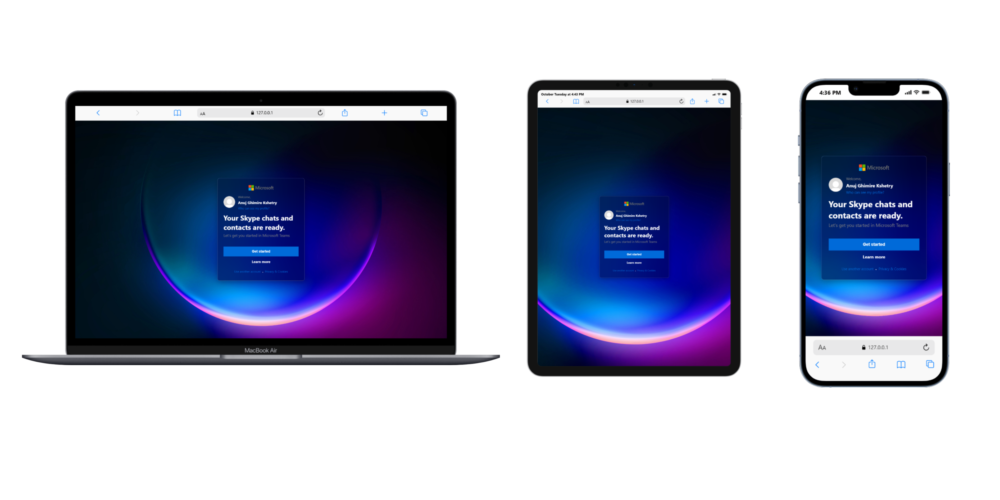

<div align="center">

# 💻 Microsoft Teams 

### A modern Microsoft Teams-style interface built with pure HTML & CSS


---

### 🚀 **Live Preview**

👉 [**View Demo on GitHub Pages**](https://anujghimire08.github.io/Microsoft-Teams/)  


</div>

---

## 📸 Preview

  


---

## 🧱 Features

- 🪟 **Glassmorphism UI** — sleek blur background with transparency  
- 🎨 **Responsive design** — adapts to all screen sizes  
- 🔤 **Segoe UI font** — Microsoft’s signature typography  
- 🔘 **Hover effects** — interactive buttons and links  
- 👤 **Profile section** — mock image, greeting, and profile link  
- ⚡ **Lightweight** — built using only HTML5 & CSS3 (no JavaScript)

---

## 🗂️ Project Structure

```text
📁 Microsoft-Teams-Clone
 ┣ 📄 index.html
 ┣ 📄 style.css
 ┣ 🖼️ img101.jpg
 ┗ 🖼️ Microsoft.png
 ┗ 🖼️ preview.png

